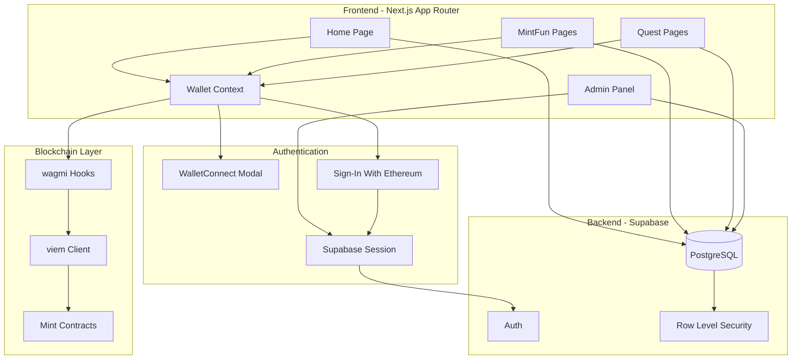

# Design Document

## Overview

This document outlines the architecture and technical design for a multi-chain NFT minting platform built with Next.js 16, Supabase, wagmi, and WalletConnect. The platform supports two minting experiences (MintFun and Quests) with full admin customization capabilities.

## Architecture



## Components and Interfaces

### Directory Structure

```
app/
├── (public)/
│   ├── page.tsx                    # Home page
│   ├── mint/[slug]/page.tsx        # MintFun campaign page
│   └── quest/[slug]/page.tsx       # Quest campaign page
├── admin/
│   ├── layout.tsx                  # Admin layout with auth guard
│   ├── page.tsx                    # Admin dashboard
│   ├── campaigns/
│   │   ├── page.tsx                # Campaign list
│   │   ├── mintfun/
│   │   │   ├── new/page.tsx        # Create MintFun
│   │   │   └── [id]/page.tsx       # Edit MintFun
│   │   └── quest/
│   │       ├── new/page.tsx        # Create Quest
│   │       └── [id]/page.tsx       # Edit Quest
│   ├── settings/
│   │   ├── page.tsx                # General settings
│   │   ├── theme/page.tsx          # Global theme
│   │   └── chains/page.tsx         # Chain management
│   └── home/page.tsx               # Home page customization
├── api/
│   ├── auth/
│   │   └── verify/route.ts         # SIWE verification
│   └── tasks/
│       └── verify/route.ts         # Task verification endpoint
├── layout.tsx
└── globals.css

components/
├── wallet/
│   ├── WalletProvider.tsx          # wagmi + WalletConnect setup
│   ├── ConnectButton.tsx           # Wallet connect/disconnect
│   └── WalletGuard.tsx             # Auth protection wrapper
├── campaigns/
│   ├── MintFunCard.tsx             # MintFun preview card
│   ├── QuestCard.tsx               # Quest preview card
│   ├── MintTierSelector.tsx        # Tier selection UI
│   ├── TaskList.tsx                # Quest task list
│   └── EligibilityBadge.tsx        # Eligibility status display
├── admin/
│   ├── CampaignForm.tsx            # Shared campaign form fields
│   ├── MintTierEditor.tsx          # Mint tier configuration
│   ├── TaskEditor.tsx              # Quest task configuration
│   ├── EligibilityEditor.tsx       # Eligibility condition editor
│   ├── ThemeEditor.tsx             # Color/font picker
│   └── CarouselEditor.tsx          # Featured items selector
├── ui/
│   ├── Button.tsx
│   ├── Input.tsx
│   ├── Card.tsx
│   ├── Modal.tsx
│   ├── Carousel.tsx
│   └── ColorPicker.tsx
└── layout/
    ├── Header.tsx
    ├── Footer.tsx
    └── ThemedContainer.tsx         # Applies dynamic theme

lib/
├── supabase/
│   ├── client.ts                   # Browser client
│   ├── server.ts                   # Server client
│   └── admin.ts                    # Service role client
├── wagmi/
│   ├── config.ts                   # wagmi configuration
│   └── chains.ts                   # Supported chains config
├── contracts/
│   ├── abi.ts                      # Mint contract ABI
│   └── addresses.ts                # Contract addresses per chain
├── utils/
│   ├── theme.ts                    # Theme CSS variable helpers
│   └── eligibility.ts              # Eligibility check helpers
└── services/
    └── chainlist.ts                # Chainlist.org API integration

hooks/
├── useWalletAuth.ts                # Wallet auth state
├── useMint.ts                      # Minting transaction hook
├── useEligibility.ts               # Eligibility verification
├── useTaskVerification.ts          # Task completion check
└── useTheme.ts                     # Dynamic theme application

types/
├── database.ts                     # Supabase generated types
├── campaign.ts                     # Campaign interfaces
├── quest.ts                        # Quest/task interfaces
└── theme.ts                        # Theme configuration types
```

### Core Interfaces

```typescript
// types/campaign.ts
interface MintFunCampaign {
  id: string;
  slug: string;
  title: string;
  description: string;
  image_url: string;
  chain_id: number;
  contract_address: string;
  mint_tiers: MintTier[];
  theme: CampaignTheme;
  is_active: boolean;
  created_at: string;
  updated_at: string;
}

interface MintTier {
  id: string;
  campaign_id: string;
  name: string;
  quantity: number;
  price: string; // In wei/native token smallest unit
  max_per_wallet: number | null;
}

interface QuestCampaign {
  id: string;
  slug: string;
  title: string;
  description: string;
  image_url: string;
  chain_id: number;
  contract_address: string;
  tasks: QuestTask[];
  eligibility: EligibilityCondition | null;
  theme: CampaignTheme;
  is_active: boolean;
  created_at: string;
  updated_at: string;
}

interface QuestTask {
  id: string;
  quest_id: string;
  type: 'twitter_follow' | 'twitter_retweet' | 'telegram_join' | 'discord_join' | 'custom_url';
  title: string;
  description: string;
  external_url: string;
  verification_data: Record<string, string>; // Platform-specific data
  order: number;
}

interface EligibilityCondition {
  id: string;
  quest_id: string;
  type: 'nft' | 'token';
  min_amount: string;
  contract_address: string | null; // Optional - if null, check any holdings
}

// types/theme.ts
interface CampaignTheme {
  primary_color: string;
  secondary_color: string;
  background_color: string;
  text_color: string;
}

interface GlobalTheme extends CampaignTheme {
  heading_font: string;
  body_font: string;
}

interface HomePageConfig {
  id: string;
  hero_title: string;
  hero_subtitle: string;
  hero_description: string;
  theme: GlobalTheme;
  featured_campaigns: string[]; // Campaign IDs
  updated_at: string;
}

// types/chain.ts

// Chainlist.org API response types (from https://chainlist.org/rpcs.json)
interface ChainlistRpc {
  url: string;
  tracking?: 'none' | 'limited' | 'yes';
}

interface ChainlistExplorer {
  name: string;
  url: string;
  standard: string;
}

interface ChainlistNetwork {
  name: string;
  chain: string;
  rpc: ChainlistRpc[];
  faucets: string[];
  nativeCurrency: {
    name: string;
    symbol: string;
    decimals: number;
  };
  infoURL: string;
  shortName: string;
  chainId: number;
  networkId: number;
  explorers: ChainlistExplorer[];
  status: 'active' | 'deprecated' | 'incubating';
  tvl?: number;
  chainSlug: string;
  isTestnet: boolean;
}

// Platform's stored chain configuration
interface SupportedChain {
  id: string;
  chain_id: number;
  name: string;
  short_name: string;
  rpc_urls: string[]; // Multiple RPCs for fallback
  explorer_url: string;
  native_currency: {
    name: string;
    symbol: string;
    decimals: number;
  };
  chain_slug: string;
  is_testnet: boolean;
  mint_contract_address: string | null;
  is_enabled: boolean;
}
```

### Wallet Provider Component

```typescript
// components/wallet/WalletProvider.tsx
'use client';

import { WagmiProvider, createConfig, http } from 'wagmi';
import { QueryClient, QueryClientProvider } from '@tanstack/react-query';
import { createWeb3Modal } from '@web3modal/wagmi/react';
import { mainnet, polygon, arbitrum, optimism, base } from 'wagmi/chains';

const projectId = process.env.NEXT_PUBLIC_WALLETCONNECT_PROJECT_ID!;

const config = createConfig({
  chains: [mainnet, polygon, arbitrum, optimism, base],
  transports: {
    [mainnet.id]: http(),
    [polygon.id]: http(),
    [arbitrum.id]: http(),
    [optimism.id]: http(),
    [base.id]: http(),
  },
});

createWeb3Modal({
  wagmiConfig: config,
  projectId,
});

const queryClient = new QueryClient();

export function WalletProvider({ children }: { children: React.ReactNode }) {
  return (
    <WagmiProvider config={config}>
      <QueryClientProvider client={queryClient}>
        {children}
      </QueryClientProvider>
    </WagmiProvider>
  );
}
```

### Minting Hook

```typescript
// hooks/useMint.ts
import { useWriteContract, useWaitForTransactionReceipt } from 'wagmi';
import { parseEther } from 'viem';
import { MINT_ABI } from '@/lib/contracts/abi';

interface UseMintParams {
  contractAddress: `0x${string}`;
  chainId: number;
}

export function useMint({ contractAddress, chainId }: UseMintParams) {
  const { writeContract, data: hash, isPending, error } = useWriteContract();
  
  const { isLoading: isConfirming, isSuccess } = useWaitForTransactionReceipt({
    hash,
  });

  const mint = async (tierId: number, quantity: number, price: string) => {
    writeContract({
      address: contractAddress,
      abi: MINT_ABI,
      functionName: 'mint',
      args: [tierId, quantity],
      value: parseEther(price),
      chainId,
    });
  };

  return {
    mint,
    isPending,
    isConfirming,
    isSuccess,
    error,
    txHash: hash,
  };
}
```

### Chainlist Service

```typescript
// lib/services/chainlist.ts
const CHAINLIST_API = 'https://chainlist.org/rpcs.json';

export async function fetchAllChains(): Promise<ChainlistNetwork[]> {
  const response = await fetch(CHAINLIST_API);
  const chains: ChainlistNetwork[] = await response.json();
  
  // Filter to active mainnets by default, allow testnets optionally
  return chains.filter(chain => chain.status === 'active');
}

export function transformToSupportedChain(chain: ChainlistNetwork): Omit<SupportedChain, 'id' | 'mint_contract_address' | 'is_enabled'> {
  // Filter to HTTP RPCs with no/limited tracking
  const httpRpcs = chain.rpc
    .filter(rpc => rpc.url.startsWith('http') && rpc.tracking !== 'yes')
    .map(rpc => rpc.url);

  return {
    chain_id: chain.chainId,
    name: chain.name,
    short_name: chain.shortName,
    rpc_urls: httpRpcs,
    explorer_url: chain.explorers?.[0]?.url || '',
    native_currency: chain.nativeCurrency,
    chain_slug: chain.chainSlug,
    is_testnet: chain.isTestnet,
  };
}

export async function searchChains(query: string): Promise<ChainlistNetwork[]> {
  const chains = await fetchAllChains();
  const lowerQuery = query.toLowerCase();
  
  return chains.filter(chain => 
    chain.name.toLowerCase().includes(lowerQuery) ||
    chain.shortName.toLowerCase().includes(lowerQuery) ||
    chain.chainId.toString() === query
  );
}
```

### Eligibility Hook

```typescript
// hooks/useEligibility.ts
import { useReadContracts, useAccount, useBalance } from 'wagmi';
import { erc721Abi, erc20Abi } from 'viem';

interface UseEligibilityParams {
  condition: EligibilityCondition | null;
  chainId: number;
}

export function useEligibility({ condition, chainId }: UseEligibilityParams) {
  const { address } = useAccount();
  
  // For NFT check with specific collection
  const { data: nftBalance } = useReadContracts({
    contracts: condition?.type === 'nft' && condition.contract_address ? [{
      address: condition.contract_address as `0x${string}`,
      abi: erc721Abi,
      functionName: 'balanceOf',
      args: [address!],
      chainId,
    }] : [],
    query: { enabled: !!address && condition?.type === 'nft' },
  });

  // For token check
  const { data: tokenBalance } = useBalance({
    address,
    token: condition?.contract_address as `0x${string}` | undefined,
    chainId,
    query: { enabled: !!address && condition?.type === 'token' },
  });

  const isEligible = () => {
    if (!condition) return true;
    if (!address) return false;

    if (condition.type === 'nft' && nftBalance?.[0]?.result) {
      return BigInt(nftBalance[0].result) >= BigInt(condition.min_amount);
    }

    if (condition.type === 'token' && tokenBalance) {
      return tokenBalance.value >= BigInt(condition.min_amount);
    }

    return false;
  };

  return {
    isEligible: isEligible(),
    isLoading: !nftBalance && !tokenBalance && !!condition,
    nftBalance: nftBalance?.[0]?.result?.toString(),
    tokenBalance: tokenBalance?.formatted,
  };
}
```

## Data Models

### Supabase Schema

```sql
-- Enable UUID extension
CREATE EXTENSION IF NOT EXISTS "uuid-ossp";

-- Supported chains table (populated from chainlist.org/rpcs.json)
CREATE TABLE supported_chains (
  id UUID PRIMARY KEY DEFAULT uuid_generate_v4(),
  chain_id INTEGER UNIQUE NOT NULL,
  name TEXT NOT NULL,
  short_name TEXT NOT NULL,
  rpc_urls JSONB NOT NULL, -- Array of RPC URLs for fallback
  explorer_url TEXT NOT NULL,
  native_currency JSONB NOT NULL,
  chain_slug TEXT NOT NULL,
  is_testnet BOOLEAN DEFAULT false,
  mint_contract_address TEXT,
  is_enabled BOOLEAN DEFAULT true,
  created_at TIMESTAMPTZ DEFAULT NOW(),
  updated_at TIMESTAMPTZ DEFAULT NOW()
);

-- MintFun campaigns table
CREATE TABLE mintfun_campaigns (
  id UUID PRIMARY KEY DEFAULT uuid_generate_v4(),
  slug TEXT UNIQUE NOT NULL,
  title TEXT NOT NULL,
  description TEXT,
  image_url TEXT NOT NULL,
  chain_id INTEGER REFERENCES supported_chains(chain_id),
  contract_address TEXT NOT NULL,
  theme JSONB NOT NULL DEFAULT '{}',
  is_active BOOLEAN DEFAULT true,
  created_at TIMESTAMPTZ DEFAULT NOW(),
  updated_at TIMESTAMPTZ DEFAULT NOW()
);

-- Mint tiers table
CREATE TABLE mint_tiers (
  id UUID PRIMARY KEY DEFAULT uuid_generate_v4(),
  campaign_id UUID REFERENCES mintfun_campaigns(id) ON DELETE CASCADE,
  name TEXT NOT NULL,
  quantity INTEGER NOT NULL,
  price TEXT NOT NULL DEFAULT '0',
  max_per_wallet INTEGER,
  order_index INTEGER DEFAULT 0,
  created_at TIMESTAMPTZ DEFAULT NOW()
);

-- Quest campaigns table
CREATE TABLE quest_campaigns (
  id UUID PRIMARY KEY DEFAULT uuid_generate_v4(),
  slug TEXT UNIQUE NOT NULL,
  title TEXT NOT NULL,
  description TEXT,
  image_url TEXT NOT NULL,
  chain_id INTEGER REFERENCES supported_chains(chain_id),
  contract_address TEXT NOT NULL,
  theme JSONB NOT NULL DEFAULT '{}',
  is_active BOOLEAN DEFAULT true,
  created_at TIMESTAMPTZ DEFAULT NOW(),
  updated_at TIMESTAMPTZ DEFAULT NOW()
);

-- Quest tasks table
CREATE TABLE quest_tasks (
  id UUID PRIMARY KEY DEFAULT uuid_generate_v4(),
  quest_id UUID REFERENCES quest_campaigns(id) ON DELETE CASCADE,
  type TEXT NOT NULL CHECK (type IN ('twitter_follow', 'twitter_retweet', 'telegram_join', 'discord_join', 'custom_url')),
  title TEXT NOT NULL,
  description TEXT,
  external_url TEXT NOT NULL,
  verification_data JSONB DEFAULT '{}',
  order_index INTEGER DEFAULT 0,
  created_at TIMESTAMPTZ DEFAULT NOW()
);

-- Eligibility conditions table
CREATE TABLE eligibility_conditions (
  id UUID PRIMARY KEY DEFAULT uuid_generate_v4(),
  quest_id UUID UNIQUE REFERENCES quest_campaigns(id) ON DELETE CASCADE,
  type TEXT NOT NULL CHECK (type IN ('nft', 'token')),
  min_amount TEXT NOT NULL,
  contract_address TEXT,
  created_at TIMESTAMPTZ DEFAULT NOW()
);

-- User task completions table
CREATE TABLE user_task_completions (
  id UUID PRIMARY KEY DEFAULT uuid_generate_v4(),
  wallet_address TEXT NOT NULL,
  task_id UUID REFERENCES quest_tasks(id) ON DELETE CASCADE,
  completed_at TIMESTAMPTZ DEFAULT NOW(),
  UNIQUE(wallet_address, task_id)
);

-- Home page configuration table
CREATE TABLE home_config (
  id UUID PRIMARY KEY DEFAULT uuid_generate_v4(),
  hero_title TEXT NOT NULL DEFAULT 'Welcome',
  hero_subtitle TEXT,
  hero_description TEXT,
  theme JSONB NOT NULL DEFAULT '{}',
  featured_campaigns UUID[] DEFAULT '{}',
  updated_at TIMESTAMPTZ DEFAULT NOW()
);

-- Admin users table (wallet-based)
CREATE TABLE admin_users (
  id UUID PRIMARY KEY DEFAULT uuid_generate_v4(),
  wallet_address TEXT UNIQUE NOT NULL,
  role TEXT DEFAULT 'admin',
  created_at TIMESTAMPTZ DEFAULT NOW()
);

-- Indexes for performance
CREATE INDEX idx_mintfun_slug ON mintfun_campaigns(slug);
CREATE INDEX idx_mintfun_active ON mintfun_campaigns(is_active);
CREATE INDEX idx_quest_slug ON quest_campaigns(slug);
CREATE INDEX idx_quest_active ON quest_campaigns(is_active);
CREATE INDEX idx_task_completions_wallet ON user_task_completions(wallet_address);
CREATE INDEX idx_chains_enabled ON supported_chains(is_enabled);
```

### Row Level Security Policies

```sql
-- Public read access for active campaigns
ALTER TABLE mintfun_campaigns ENABLE ROW LEVEL SECURITY;
CREATE POLICY "Public can view active mintfun campaigns" ON mintfun_campaigns
  FOR SELECT USING (is_active = true);

ALTER TABLE quest_campaigns ENABLE ROW LEVEL SECURITY;
CREATE POLICY "Public can view active quest campaigns" ON quest_campaigns
  FOR SELECT USING (is_active = true);

-- Public read for related tables
ALTER TABLE mint_tiers ENABLE ROW LEVEL SECURITY;
CREATE POLICY "Public can view mint tiers" ON mint_tiers
  FOR SELECT USING (true);

ALTER TABLE quest_tasks ENABLE ROW LEVEL SECURITY;
CREATE POLICY "Public can view quest tasks" ON quest_tasks
  FOR SELECT USING (true);

ALTER TABLE eligibility_conditions ENABLE ROW LEVEL SECURITY;
CREATE POLICY "Public can view eligibility conditions" ON eligibility_conditions
  FOR SELECT USING (true);

-- Users can manage their own task completions
ALTER TABLE user_task_completions ENABLE ROW LEVEL SECURITY;
CREATE POLICY "Users can view own completions" ON user_task_completions
  FOR SELECT USING (true);
CREATE POLICY "Users can insert own completions" ON user_task_completions
  FOR INSERT WITH CHECK (true);

-- Home config is public read
ALTER TABLE home_config ENABLE ROW LEVEL SECURITY;
CREATE POLICY "Public can view home config" ON home_config
  FOR SELECT USING (true);

-- Chains are public read
ALTER TABLE supported_chains ENABLE ROW LEVEL SECURITY;
CREATE POLICY "Public can view enabled chains" ON supported_chains
  FOR SELECT USING (is_enabled = true);
```

## Error Handling

### Error Types

```typescript
// lib/errors.ts
export class MintError extends Error {
  constructor(
    message: string,
    public code: 'INSUFFICIENT_FUNDS' | 'USER_REJECTED' | 'CONTRACT_ERROR' | 'NETWORK_ERROR'
  ) {
    super(message);
    this.name = 'MintError';
  }
}

export class EligibilityError extends Error {
  constructor(
    message: string,
    public requirement: { type: 'nft' | 'token'; minAmount: string; current: string }
  ) {
    super(message);
    this.name = 'EligibilityError';
  }
}

export class AuthError extends Error {
  constructor(
    message: string,
    public code: 'SIGNATURE_INVALID' | 'SESSION_EXPIRED' | 'UNAUTHORIZED'
  ) {
    super(message);
    this.name = 'AuthError';
  }
}
```

### Error Handling Strategy

| Error Type | User Message | Recovery Action |
|------------|--------------|-----------------|
| Insufficient funds | "Not enough balance to complete this mint" | Show required amount, link to bridge/swap |
| User rejected tx | "Transaction was cancelled" | Allow retry |
| Contract error | "Minting failed. Please try again" | Show error details, allow retry |
| Network error | "Network connection issue" | Auto-retry with exponential backoff |
| Eligibility failed | "You need X NFTs/tokens to participate" | Show current balance vs required |
| Session expired | "Session expired. Please reconnect" | Trigger wallet reconnect |

