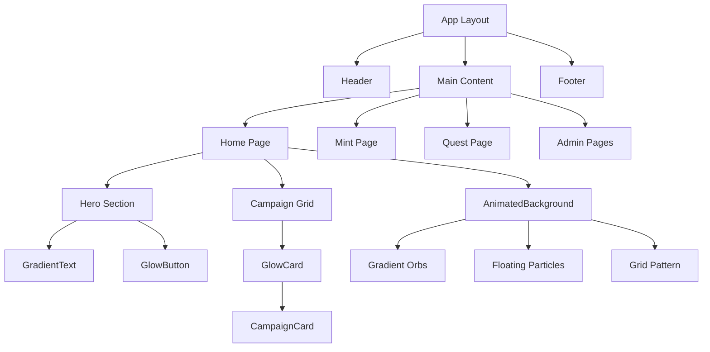

# Design Document: shadcn/ui Futuristic Redesign

## Overview

This design document outlines the technical architecture and implementation details for transforming the Multi-Chain Mint Platform UI using shadcn/ui components with a futuristic aesthetic. The redesign focuses on creating an immersive, visually stunning experience while maintaining performance and accessibility.

## Architecture

### Technology Stack

```
┌─────────────────────────────────────────────────────────────┐
│                    Application Layer                         │
├─────────────────────────────────────────────────────────────┤
│  Next.js 16 (App Router)                                    │
│  React 19                                                    │
│  TypeScript                                                  │
├─────────────────────────────────────────────────────────────┤
│                    UI Component Layer                        │
├─────────────────────────────────────────────────────────────┤
│  shadcn/ui Components (Radix UI primitives)                 │
│  Custom Futuristic Components                                │
│  Framer Motion (animations)                                  │
├─────────────────────────────────────────────────────────────┤
│                    Styling Layer                             │
├─────────────────────────────────────────────────────────────┤
│  Tailwind CSS v4                                            │
│  CSS Variables (theming)                                     │
│  class-variance-authority (variants)                         │
└─────────────────────────────────────────────────────────────┘
```

### File Structure

```
components/
├── ui/                          # shadcn/ui components
│   ├── button.tsx
│   ├── card.tsx
│   ├── input.tsx
│   ├── dialog.tsx
│   ├── skeleton.tsx
│   ├── badge.tsx
│   └── ...
├── futuristic/                  # Custom futuristic components
│   ├── animated-background.tsx  # Gradient + particle background
│   ├── glow-card.tsx           # Glassmorphism card wrapper
│   ├── gradient-text.tsx       # Animated gradient text
│   ├── floating-particles.tsx  # Particle effect system
│   └── glow-button.tsx         # Button with glow effect
├── layout/
│   ├── Header.tsx              # Updated with glassmorphism
│   ├── Footer.tsx
│   └── ThemedContainer.tsx
└── campaigns/
    ├── CampaignCard.tsx        # Updated with new styling
    └── ...

lib/
└── utils.ts                    # cn() utility function
```

## Components and Interfaces

### 1. Utility Function (lib/utils.ts)

```typescript
import { type ClassValue, clsx } from "clsx";
import { twMerge } from "tailwind-merge";

export function cn(...inputs: ClassValue[]) {
  return twMerge(clsx(inputs));
}
```

### 2. Animated Background Component

The hero section will feature a multi-layered animated background:

```typescript
interface AnimatedBackgroundProps {
  variant?: 'hero' | 'subtle' | 'particles';
  className?: string;
  children?: React.ReactNode;
}
```

**Visual Layers:**
1. Base gradient layer (dark to darker)
2. Animated gradient orbs (blur + opacity animation)
3. Grid pattern overlay (subtle lines)
4. Optional particle system

**CSS Animation Strategy:**
- Use CSS `@keyframes` for gradient animations
- Transform-based animations for performance
- `will-change: transform, opacity` for GPU acceleration

### 3. Glassmorphism Card Component

```typescript
interface GlowCardProps {
  children: React.ReactNode;
  className?: string;
  glowColor?: string;
  intensity?: 'low' | 'medium' | 'high';
  hover?: boolean;
}
```

**Styling Properties:**
- `backdrop-blur-xl` for frosted glass effect
- `bg-white/5` or `bg-black/20` for transparency
- Border with gradient or glow on hover
- Box shadow with color matching theme

### 4. shadcn/ui Button Variants

Extend the default button with futuristic variants:

```typescript
const buttonVariants = cva(
  "inline-flex items-center justify-center rounded-lg font-medium transition-all",
  {
    variants: {
      variant: {
        default: "bg-primary text-primary-foreground hover:bg-primary/90",
        glow: "bg-primary text-white shadow-[0_0_20px_rgba(var(--primary-rgb),0.5)] hover:shadow-[0_0_30px_rgba(var(--primary-rgb),0.7)]",
        glass: "bg-white/10 backdrop-blur-md border border-white/20 hover:bg-white/20",
        outline: "border-2 border-primary text-primary hover:bg-primary hover:text-white",
        ghost: "hover:bg-white/10",
      },
      size: {
        sm: "h-9 px-3 text-sm",
        default: "h-10 px-4",
        lg: "h-12 px-8 text-lg",
        xl: "h-14 px-10 text-xl",
      },
    },
  }
);
```

### 5. Header Component Design

```
┌────────────────────────────────────────────────────────────────┐
│  [Logo]                    [Nav Links]         [Connect Wallet]│
│                                                                 │
│  Glassmorphism background with scroll-based opacity            │
│  backdrop-blur increases on scroll                              │
└────────────────────────────────────────────────────────────────┘
```

**Scroll Behavior:**
- Initial: Transparent background
- On scroll: `bg-black/80 backdrop-blur-xl`
- Smooth transition with `transition-all duration-300`

## Data Models

No changes to existing data models. The redesign is purely presentational.

## Error Handling

### Animation Fallbacks
- Detect `prefers-reduced-motion` and disable complex animations
- Provide static fallbacks for browsers without backdrop-filter support
- Graceful degradation for older browsers

### Component Error Boundaries
- Wrap animated components in error boundaries
- Fall back to static versions on animation errors

## Testing Strategy

### Visual Testing
- Storybook stories for each new component
- Visual regression testing for key pages
- Cross-browser testing (Chrome, Firefox, Safari, Edge)

### Accessibility Testing
- Automated a11y testing with axe-core
- Manual keyboard navigation testing
- Screen reader testing for dynamic content

### Performance Testing
- Lighthouse performance audits
- Animation frame rate monitoring
- Bundle size analysis

## Implementation Details

### Color System

```css
:root {
  /* Futuristic color palette */
  --background: 10 10 15;        /* Near black */
  --foreground: 248 250 252;     /* Off white */
  
  --primary: 99 102 241;         /* Indigo */
  --primary-rgb: 99, 102, 241;
  
  --secondary: 168 85 247;       /* Purple */
  --secondary-rgb: 168, 85, 247;
  
  --accent: 34 211 238;          /* Cyan */
  --accent-rgb: 34, 211, 238;
  
  /* Glassmorphism */
  --glass-bg: rgba(255, 255, 255, 0.05);
  --glass-border: rgba(255, 255, 255, 0.1);
  --glass-blur: 20px;
}
```

### Animation Keyframes

```css
@keyframes gradient-shift {
  0%, 100% { background-position: 0% 50%; }
  50% { background-position: 100% 50%; }
}

@keyframes float {
  0%, 100% { transform: translateY(0px); }
  50% { transform: translateY(-20px); }
}

@keyframes pulse-glow {
  0%, 100% { opacity: 0.5; }
  50% { opacity: 1; }
}

@keyframes particle-float {
  0% { transform: translateY(100vh) rotate(0deg); opacity: 0; }
  10% { opacity: 1; }
  90% { opacity: 1; }
  100% { transform: translateY(-100vh) rotate(720deg); opacity: 0; }
}
```

### Hero Section Layout

```
┌─────────────────────────────────────────────────────────────────┐
│                     ANIMATED BACKGROUND                          │
│  ┌─────────────────────────────────────────────────────────┐    │
│  │              Gradient Orb 1 (blur, animate)              │    │
│  │                                                          │    │
│  │     ┌─────────────────────────────────────────┐         │    │
│  │     │         HERO CONTENT                     │         │    │
│  │     │                                          │         │    │
│  │     │   [Subtitle - uppercase, tracking]       │         │    │
│  │     │   [Title - gradient text, large]         │         │    │
│  │     │   [Description - muted]                  │         │    │
│  │     │                                          │         │    │
│  │     │   [CTA Button]  [Secondary Button]       │         │    │
│  │     └─────────────────────────────────────────┘         │    │
│  │                                                          │    │
│  │              Gradient Orb 2 (blur, animate)              │    │
│  └─────────────────────────────────────────────────────────┘    │
│                     FLOATING PARTICLES                           │
└─────────────────────────────────────────────────────────────────┘
```

### Campaign Card Design

```
┌─────────────────────────────────────┐
│  ┌─────────────────────────────┐   │  Glassmorphism container
│  │                             │   │  with glow border on hover
│  │         IMAGE               │   │
│  │                             │   │
│  │    [Badge: Chain/Type]      │   │
│  └─────────────────────────────┘   │
│                                     │
│  Title                              │
│  Description (truncated)            │
│                                     │
│  ─────────────────────────────────  │
│  [Price/Status]        [Action →]   │
└─────────────────────────────────────┘
```

## Dependencies to Install

```json
{
  "dependencies": {
    "class-variance-authority": "^0.7.0",
    "clsx": "^2.1.0",
    "tailwind-merge": "^2.2.0",
    "lucide-react": "^0.400.0",
    "@radix-ui/react-dialog": "^1.0.5",
    "@radix-ui/react-slot": "^1.0.2"
  }
}
```

## Migration Strategy

1. **Phase 1**: Install dependencies and set up shadcn/ui configuration
2. **Phase 2**: Create futuristic background and utility components
3. **Phase 3**: Migrate existing UI components to shadcn/ui
4. **Phase 4**: Update home page with new hero section
5. **Phase 5**: Apply styling to campaign cards and grids
6. **Phase 6**: Update mint page and admin dashboard
7. **Phase 7**: Polish animations and test accessibility

## Mermaid Diagram: Component Hierarchy



## Accessibility Considerations

1. **Reduced Motion**: All animations wrapped in `@media (prefers-reduced-motion: no-preference)`
2. **Color Contrast**: Minimum 4.5:1 ratio for normal text, 3:1 for large text
3. **Focus States**: Visible focus rings on all interactive elements
4. **Keyboard Navigation**: Full keyboard support for all components
5. **Screen Readers**: Proper ARIA labels and semantic HTML
